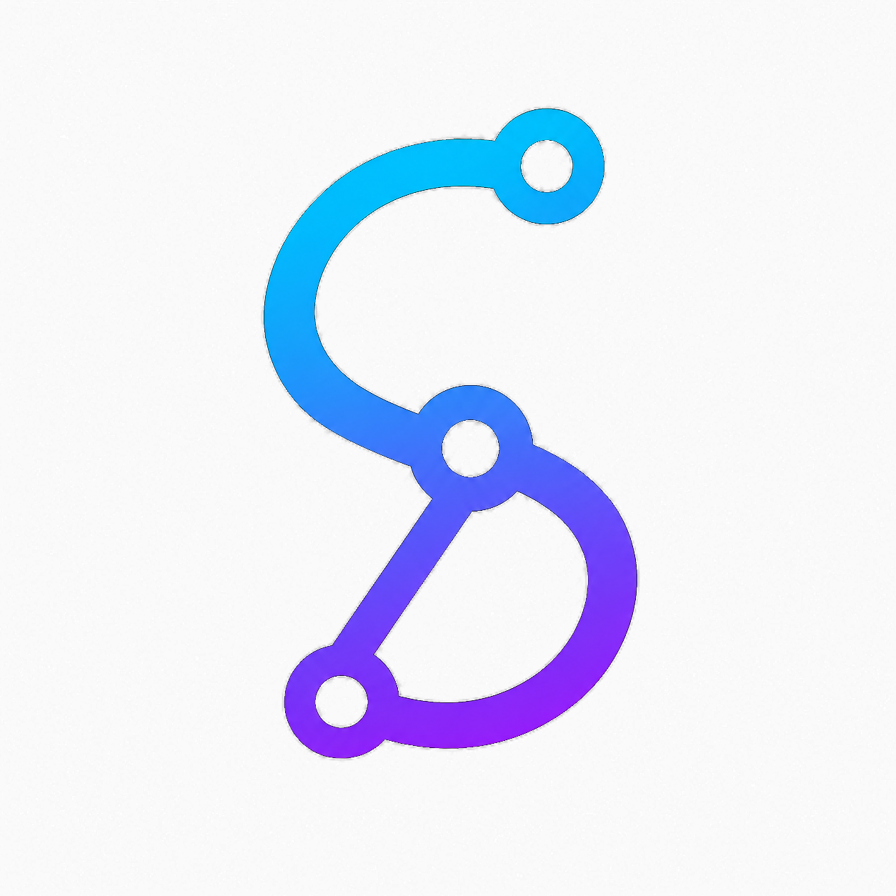

<p align="center">
  
</p>

<h1 align="center">Aflow Agent</h1>

<p align="center">
  <a href="README.md">English</a> | 简体中文
</p>

<p align="center">
  
</p>

<p align="center">
  Specflow 将 Agent 工作组织为可见工作流，Aflow Agent 基于它构建。
</p>

<p align="center">
  <a href="docs/acp-compatibility.md">ACP Compatibility</a>
</p>

## 它是什么

Specflow 是面向 Agent 工作的工作流基础设施。它让你把流程描述为可编辑的 workflow-as-code，接入一个或多个 Agent 执行流程，观察决策与产出，并在跨 session 的上下文中持续推进复杂任务。

Aflow Agent 是基于 Specflow 制作的 Agent，用来辅助设计和运行这些工作流。它可以在你搭建 workflow 时提供帮助，也可以在执行复杂任务时，以计划步骤、审查关卡和后续路径推进任务，而不是把所有上下文堆在一次长对话里。

Specflow 不只面向代码任务。它可以接入任意自定义 Agent，用来构建业务流程、研究流程、审查流程、自动化流程，或面向具体行业和团队的垂直工作流。当用于开发场景时，它也可以生成和维护 spec 文档，辅助 SDD，也就是 Spec-Driven Development，让实现工作从明确的目标、约束和预期结果开始。

## 它能做什么

- 将重复性的 Agent 工作沉淀为 workflow-as-code。
- 把复杂任务拆成可见节点、分支决策、审查关卡和后续路径。
- 接入自定义 Agent，并把它们组合进同一个工作流。
- 让多个能力不同的 Agent 在同一个工作流中协作。
- 支持跨 session 协作，让上下文、决策和运行历史可追踪。
- 在开发工作流中生成 spec 文档，辅助 SDD 风格的清晰协作。
- 用于业务流程、研究流程、代码工作流，或任何需要明确过程和审查的复杂任务。

## Workspace 文件

Workflow-as-code 文件保存在 `.specflow/agentflows/*.yaml`。

浏览器画布布局生成到 `.specflow/canvas/*.json`，并默认被忽略，因此 workflow 可以被编写和 review，而不需要手写 UI 坐标。

Agent server 配置在 `.specflow/agent-servers.json` 中。本地密钥和机器相关覆盖项建议写入 `.specflow/agent-servers.local.json`；它会按 agent id 与共享配置深度合并。

本地密钥覆盖示例：

```json
{
  "agent_servers": {
    "codex-acp": {
      "env": {
        "OPENAI_API_KEY": "sk-...",
        "http_proxy": "http://127.0.0.1:7890",
        "https_proxy": "http://127.0.0.1:7890"
      }
    }
  }
}
```

自定义 ACP Agent 示例：

```json
{
  "agent_servers": {
    "my-acp-agent": {
      "type": "custom",
      "command": "node",
      "args": ["./agents/my-agent.js", "--acp"],
      "cwd": ".",
      "env": {
        "MY_AGENT_API_KEY": "..."
      },
      "additionalDirectories": ["../shared-workspace"]
    }
  }
}
```

Specflow 支持的 agent server 自定义 key：

- `env`：传给 agent 进程的环境变量。ACP `env_var` 认证方法会从这里读取所需变量；如果代理或 VPN 导致 agent 无法访问网络，也可以在这里配置 `http_proxy` 和 `https_proxy`。

Agent server 条目只保存进程启动所需设置，例如 `type`、`command`、`args`、`cwd`、`env` 和 `additionalDirectories`。自定义 ACP Agent 需要通过 stdio 实现 ACP。认证、terminal capability 和 permission prompt 都由 ACP 在运行时驱动。Mode、model、reasoning 和 config override 应该配置在 workflow 或节点级别，而不是 agent server 配置里。

## 开发

Specflow 使用 [mise](https://mise.jdx.dev/) 固定 Bun 版本。

安装 mise：

```sh
curl https://mise.run | sh
```

在 shell 中启用 mise。bash 示例：

```sh
echo 'eval "$(~/.local/bin/mise activate bash)"' >> ~/.bashrc
source ~/.bashrc
```

zsh 示例：

```sh
echo 'eval "$(~/.local/bin/mise activate zsh)"' >> ~/.zshrc
source ~/.zshrc
```

然后进入本仓库并信任本地 mise 配置：

```sh
cd specflow-code
mise trust
bun --version
```

安装依赖：

```sh
bun install
```

启动开发服务：

```sh
bun run dev
```

该命令会启动 Specflow server，并打印浏览器 URL：

```text
Specflow UI: http://localhost:5173/
```

开发模式下，server 会把 UI 请求代理到 Vite，因此 React 更新会比较快。生产模式下，server 会从编译后的二进制中提供内嵌的静态 UI。

## Scripts

```sh
bun run dev        # 启动 server + Vite dev proxy
bun run build      # build:ui 后 build:bin，生成 ./specflow
bun run typecheck  # 对所有 packages 做类型检查
```
